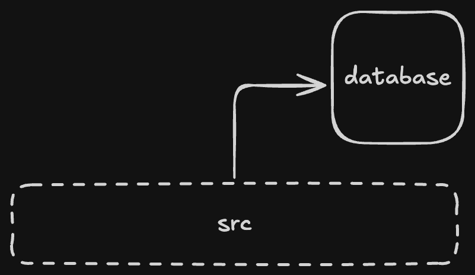
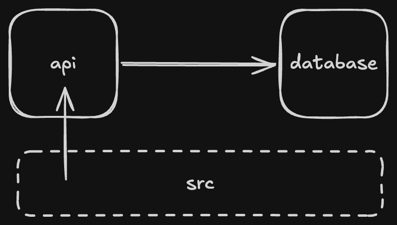
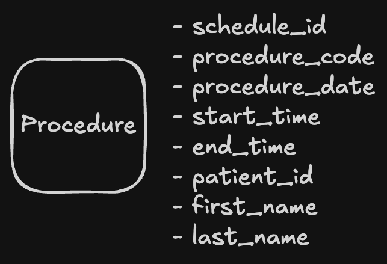
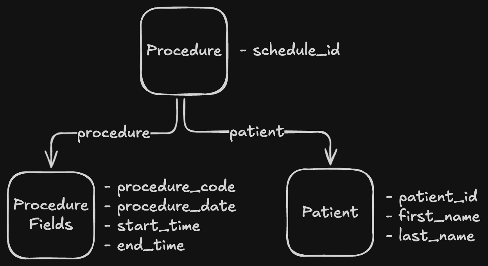
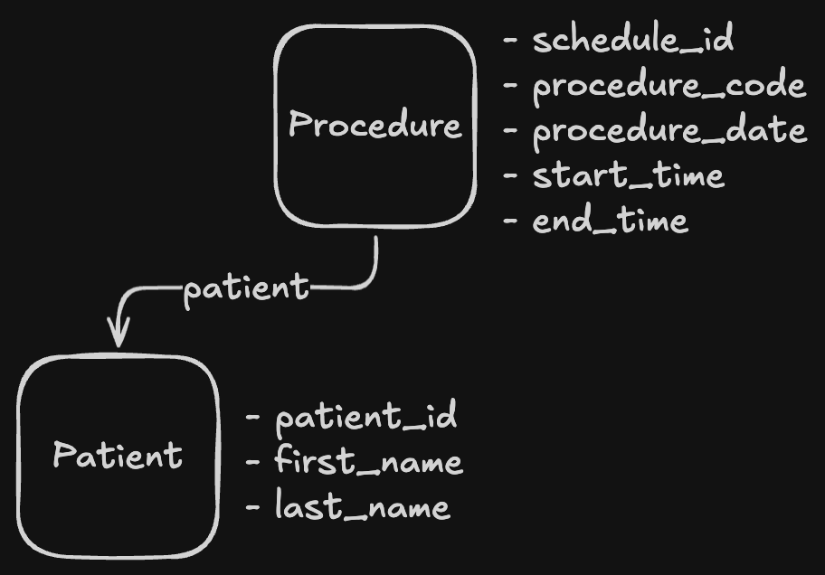

# Scheduling


Scheduling ingestion layer.

- [Usage](#usage)
- [Examples](#examples)
- [Tooling](#tooling)
- [Discussion](#discussion)

## Usage

### Installing

```sh
poetry install --with all
```

This installs all the project dependencies and the development tooling.

### Running

To start the application, set these environment variables:

| Variable                      | Value                         |
| ----------------------------- | ----------------------------- |
| `DJANGO_SETTINGS_MODULE`      | `"scheduling.settings.local"` |
| `DJANGO_SECRET_KEY`           | Generate a random key         |
| `DJANGO_FIELD_ENCRYPTION_KEY` | Generate a random key         |

Start the database container:

```sh
docker compose up database
```

Start the development server:

```sh
python src/manage.py runserver
```

This will connect your server with the database container:

<div align='center'>
    
</div>

#### Containerisation

To run as the api service as a container set the postgres host to the service name:

| Variable        | Value                   |
| --------------- | ----------------------- |
| `POSTGRES_HOST` | `"scheduling-database"` |

```sh
docker compose up --build
```

This will launch and connect an api service container with the database container:

<div align='center'>
    
</div>

#### Production

To run in production, set these environment variables:

| Variable                 | Value                        |
| ------------------------ | ---------------------------- |
| `DJANGO_SETTINGS_MODULE` | `"scheduling.settings.prod"` |
| `DJANGO_HOST_DOMAIN`     | Deployment domain            |
| `POSTGRES_DB`            | Database name                |
| `POSTGRES_USER`          | Database user                |
| `POSTGRES_PASSWORD`      | Database password            |

### Endpoints

The application exposes the following endpoints:

| Endpoint   | Purpose                         |
| ---------- | ------------------------------- |
| `/ingest/` | HL7 procedure ingestion service |
| `/admin/*` | Django admin interface          |
| `/docs/`   | Swagger UI (OpenAPI)            |

## Examples

> Unit tests for these requests/responses are in `tests/*`.

### Procedure creation

Given a valid HL7 procedure payload a procedure and patient instance are created.

Request:

```txt
MSH|^~\&|EMR|HOSPITAL1|VIDEO_SYS|OUR_PLATFORM|202501011030||SIU^S
SCH|A1001|PROC123|20250102|093000|120000
PID|123456|DOE^JOHN
```

Response:

```json
{
  "id": 1,
  "schedule_id": "A1001",
  "procedure_code": "PROC123",
  "procedure_date": "2025-01-02",
  "start_time": "09:30:00",
  "end_time": "12:00:00",
  "patient": {
    "id": 1,
    "patient_id": "123456",
    "first_name": "JOHN",
    "last_name": "DOE"
  }
}
```

### Parsing errors

If the HL7 payload cannot be parsed, a structured error message is returned.

Request:

```txt
MSH|^~\&|EMR|HOSPITAL1|VIDEO_SYS|OUR_PLATFORM|202501011030||SIU^S
SCH|A1001|PROC123|20250102|093000|120000
```

Response:

```json
{
  "type": "client_error",
  "errors": [
    {
      "code": "parse_error",
      "detail": "Expected 3 PID fields",
      "attr": null
    }
  ]
}
```

### Validation errors

If the HL7 payload contains invalid field data, a structured error message is returned.

Request:

```txt
MSH|^~\&|EMR|HOSPITAL1|VIDEO_SYS|OUR_PLATFORM|202501011030||SIU^S
SCH|A1001|PROC123|20250102|093000|999999
PID|123456|DOE^JOHN
```

Response:

```json
{
  "type": "validation_error",
  "errors": [
    {
      "code": "invalid",
      "detail": "Time has wrong format. Use one of these formats instead: hh:mm[:ss[.uuuuuu]].",
      "attr": "end_time"
    }
  ]
}
```

### Tooling

`just` is used to aggregate tooling scripts into groups:

#### Linters

```sh
just lint
```

#### Formatters

```sh
just format
```

#### Tests

```sh
just test
```

## Discussion

### Assumptions

1. `Schedule ID` is an opaque reference string

It is not an internal schedule table foreign key

2. There are reasonable field length constraints

- `schedule_id`: 75 characters
- `procedure_code`: 50 characters
- `patient_id`: 50 characters
- `first_name`: 100 characters
- `last_name`: 100 characters

After encryption names can be assumed to be less than 200 characters.

3. No need to implement a full HL7 parser for other payload types

4. Only the `patient_id`, `first_name`, `last_name` should be encrypted

### Approach

#### Validation

HL7 is not parsed in the serializer classes. Instead, parsing and validation are split into separate steps:

- Structure validation: `services/*` modules validate the basic HL7 structure independently, allowing thorough testing and clear separation of concerns
- Field validation: Individual field validators (e.g., DateField) remain in the serializer for domain-specific validation

An intermediate dataclass, `ProcedurePayload`, bridges the parsing and validation.

#### Models

A single model could combine patient and procedure data into one table. This approach would cause significant field duplication since a patient can have many procedures. A likely future feature would be to allow queries for a specific patient's procedures. A single model would make this impractical.

<div align='center'>
    
</div>

Three models separate patient, procedure, and common procedure fields into individual tables. This provides better structure but would require a significant amount of seed data mapping procedure codes and names to be beneficial which is impractical for this use case.

<div align='center'>
    
</div>

Using two models separates the patient and procedure data while keeping the implementation manageable. The `ProcedureSerializer` calls `Patient.objects.get_or_create` to handle patient lookups or creation.

<div align='center'>
    
</div>

This allows for a rich, well-organized response:

```json
{
  "id": 1,
  "schedule_id": "A1001",
  "procedure_code": "PROC123",
  "procedure_date": "2025-01-02",
  "start_time": "09:30:00",
  "end_time": "12:00:00",
  "patient": {
    "id": 1,
    "patient_id": "123456",
    "first_name": "JOHN",
    "last_name": "DOE"
  }
}
```

#### Encryption

The `encrypted_model_fields` package is used to encrypt the patient fields:

```py
from django.db import models
from encrypted_model_fields.fields import EncryptedCharField


class Patient(models.Model):
    patient_id = EncryptedCharField(max_length=200, unique=True)
    first_name = EncryptedCharField(max_length=200)
    last_name = EncryptedCharField(max_length=200)
```
